# シンプルな汎用反復型エージェント基盤 実装計画 — 視覚ガイド

> 対応する実装計画:
> [`generic_iterative_agent_framework_plan.md`](generic_iterative_agent_framework_plan.md)
>
> 本書は人間が構造と処理を理解するための図解である。型、制約、status、実装Phase、完了条件の正本は
> 対応する実装計画とする。

## 1. 全体像

登場人物を増やさず、意味判断はSolverへ集約する。ProjectorはLLMではなく、保存状態から入力を作る
決定的な処理である。

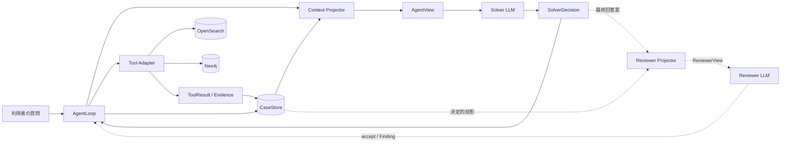

| 要素 | 一言でいうと |
|---|---|
| CaseStore | 案件の正本 |
| Context Projector | 正本から、今回LLMへ見せる情報を取り出す処理 |
| AgentView | Solverへ渡す読み取り専用の入力 |
| Solver | 仮説、検索、関連性、根拠、完了を判断するLLM |
| AgentLoop | 呼出し、保存、予算、構造検証を進めるプログラム |
| Tool Adapter | Solverの検索要求を固定されたbackend操作へ変換する処理 |
| Reviewer | 有効時だけ最終回答案を検査するLLM |

Reviewer有効時も新しい探索Agentは増えない。Reviewer ProjectorはCaseStoreから質問、回答、WorkItem、
Hypothesis、DependencyDecision、取得済みgrounding Evidenceを機械投影する。Reviewerは不整合をFindingとして
返し、Solverが回答修正か追加調査かを判断する。

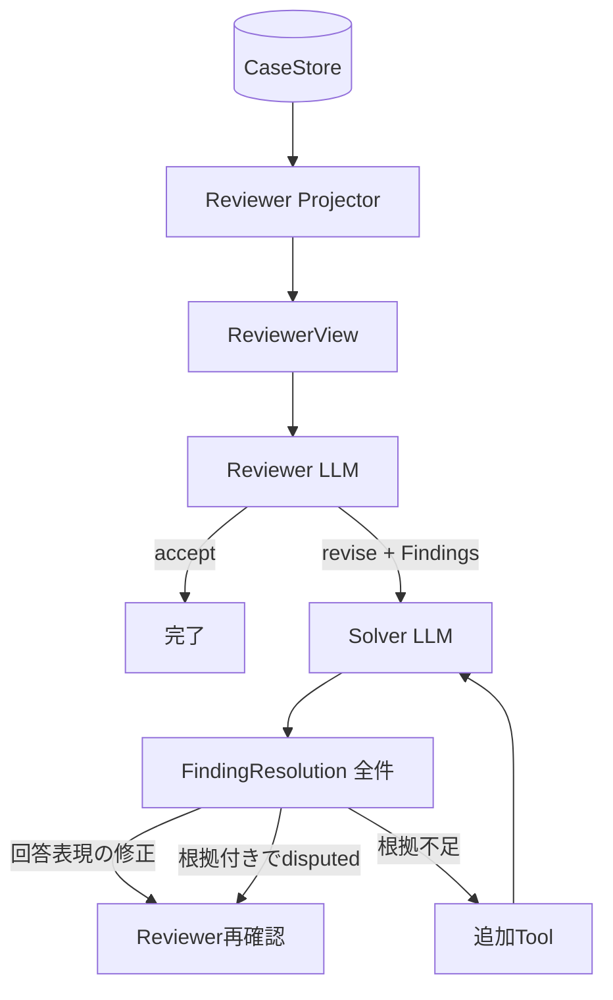

ProgramはFindingとResolutionの既知ID・全件性・参照整合だけを検証し、どの指摘が法的に正しいかや
どのToolを使うかを決めない。

## 2. CaseStore、Projector、AgentViewの関係

同じ情報を三重に保存する構造ではない。CaseStoreだけが正本で、AgentViewは呼出し用途ごとに作り直す。

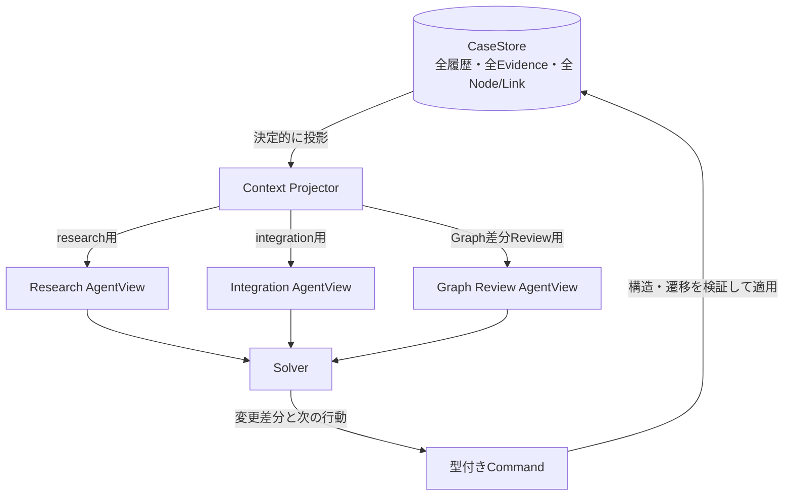

Projectorは関連性を選ばない。本文枠、安定順、既知ID、現在の処理モードなど、契約で決められた条件だけで
表示を組み立てる。

## 3. WorkItem、Hypothesis、探索の関係

問いの分解と情報源の探索を別構造にする。

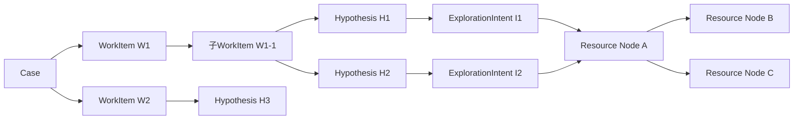

- WorkItemは「何を解くか」の階層である。
- Hypothesisは「本文で何を確かめるか」である。
- ExplorationIntentは「その確認のため、どの範囲をどう検索するか」である。
- Resource Nodeは情報源そのもので、同じArticleは案件内で1件に正規化する。
- DiscoveryLinkは発見経路であり、同じNodeへ複数残せる。
- Frontierは`Node × Hypothesis`単位なので、H1で不要でもH2で必要になり得る。

## 4. 1 Cycleの流れ

1 CycleはTool 1回やGraph 1ホップではない。1つの仮説・探索方針を、複数Stepで検証して評価する単位である。

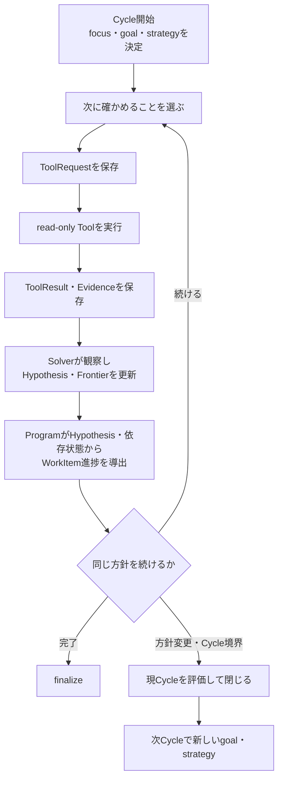

Legal Profileでは1 CycleのArticle本文取得を累計5件以内、Graph候補から1 Stepで選ぶ本文を3件以内、
Research Cycleを最大4回とする。上限値は目標ではなく、暴走防止の機械的制約である。

## 5. OpenSearchとNeo4jの使い分け

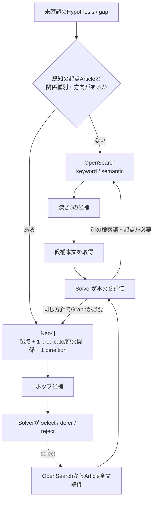

Neo4jは本文の保管場所ではない。Graphで候補Article IDと関係を発見し、本文はOpenSearchからArticle単位で
取得する。Graph候補だけを根拠として採用しない。

## 6. Graph候補と本文取得は別の状態

候補の関連性と本文取得の成否を1つのstatusへまとめない。

| Graph候補のReview | 意味 | 本文statusとは独立 |
|---|---|---|
| `unreviewed` | 現Hypothesisでは未評価 | 本文取得済みの場合もある |
| `selected` | Solverが今回の本文取得対象に選んだ | 取得成功を意味しない |
| `relevant_deferred` | 関連するが今回の枠外 | 次Step・次Cycleへ残す |
| `rejected` | 現Hypothesisでは不要とSolverが判断 | 別Hypothesisへ自動転用しない |

| 本文status | 意味 |
|---|---|
| `not_requested` | 未要求 |
| `pending` | 要求済み、結果待ち |
| `succeeded` | OpenSearchに登録済みの当該Article全chunkを取得完了 |
| `failed / timeout` | 全chunkを取得できず失敗または時間切れ |

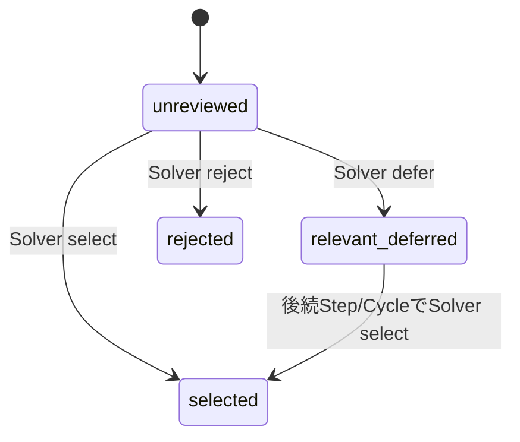

`rejected`を別Hypothesisで使う場合、元のFrontierを書き換えない。Solverの明示的な再採用により、同じNodeと
別Hypothesisの組合せで新しい`unreviewed` Frontierを作る。

## 7. Cycle間の引継ぎ

Cycle 1の最後にCycle 2の詳細計画まで作らない。Cycle 1は自分の結果と未解決事項を確定し、Cycle 2が
引き継いだ状態を見て新しい計画を作る。

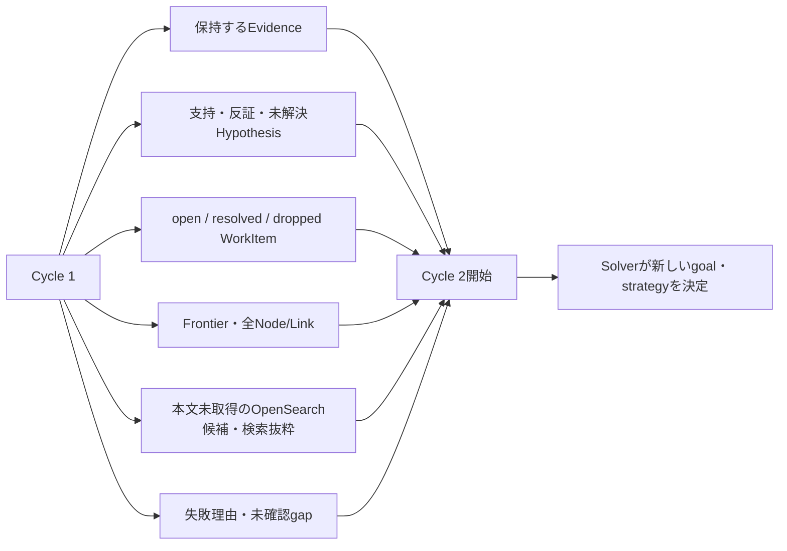

引き継がないものは、過去のLLM生応答、同じ本文の重複コピー、次Cycleに固定された検索queryである。
OpenSearch候補は本文取得に成功するまで、候補IDだけでなく発見元と検索抜粋もCase履歴から再構成する。
新規候補のReviewと過去の保留候補は混ぜず、Review後の通常処理で保留候補を再び選べるようにする。

## 8. 非同期Relation分類

回答時のSolverとは別のオフライン処理である。Programは候補を作り、法的意味の分類はLLMが行う。

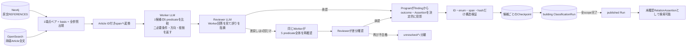

1 sessionには最大5候補のshardを渡せるが、候補ごとに独立した判定recordを返し、別候補の本文・判断を
根拠へ流用しない。保存checkpointも候補単位なので、1候補ずつ再開できる。Workerは5関係のfinding・方向・
両端根拠を一度に判断し、ReviewerはWorker回答を知った上で具体的な誤りを指摘する。Programは法的意味を
補わず、承認されたassessmentだけをRelationAssertionへ写す。

## 9. 共有法令Graphの形

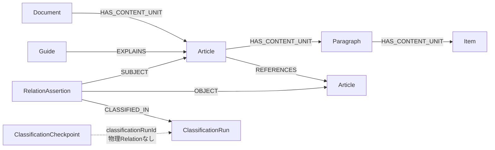

`IMPLEMENTS / INCORPORATES / USES_DEFINITION / EXCEPTION_TO / OVERRIDES`は物理Edgeではなく、
RelationAssertionの`proposedPredicate`である。RelationAssertionは共有候補であり、案件で確認済みの正式関係ではない。

検索時にはpredicate名だけを見せない。Projectorは意味方向、両端の根拠抜粋、承認Reviewerの短い説明も
AgentViewへ投影する。特に`USES_DEFINITION`は次のように読む。

```text
利用側Article (SUBJECT)
  └─ どの語・法的役割・地位・scopeを使うか
          │  USES_DEFINITION
          │  relationExplanation + 両端supportingQuote
          ▼
定義側Article (OBJECT)
  └─ その意味・範囲をどの本文で定めるか
```

Solverは現在のHypothesisがその意味・範囲に依存するときだけ定義側本文を取得する。逆に定義の適用先を
問う場合だけ利用側へたどる。全候補を順にたどるのではなく、`relationExplanation`が示す具体的な概念と
Hypothesisが一致する候補だけを選ぶ。候補がない場合も「定義関係なし」とは断定せず、必要ならOpenSearchへ戻る。
説明と抜粋は候補選別用であり、回答根拠にはArticle全文の取得が必要である。

## 10. 5つの意味関係の整理

### 10.1 原文関係と意味関係は別物

`REFERENCES`と`EXPLAINS`は、原文やガイドから決定的に確認できる物理関係である。一方、次の5つは
両端Article全文をLLMが読んで作る意味関係候補であり、Neo4j上では`RelationAssertion`として保存する。

```text
原文・構造から確認できる関係
├─ REFERENCES   ある規定が別の規定を明示参照する
└─ EXPLAINS     ガイドが特定Articleを明示的に解説する

本文の意味判断が必要な関係候補
├─ IMPLEMENTS
├─ INCORPORATES
├─ USES_DEFINITION
├─ EXCEPTION_TO
└─ OVERRIDES
```

`REFERENCES`があるだけでは5つのどれが成立するかは分からない。反対に、1組のArticle間で複数の意味関係が
同時に成立することもある。例えば、下位規定が委任事項を具体化しながら親規定の定義語も利用する場合は、
`IMPLEMENTS`と`USES_DEFINITION`が両方成立し得る。

### 10.2 各関係の意味と向き

すべての意味関係は`SUBJECT → OBJECT`として読む。ここでSUBJECT / OBJECTはGraph上の端点役割であり、
契約当事者、文法上の主語、法律上の主体・客体を意味しない。

| 関係 | 何を表すか | SUBJECT | OBJECT | 代表的な手掛かり | それだけでは足りないもの |
|---|---|---|---|---|---|
| `IMPLEMENTS` | 上位規定の委任事項を下位規定が具体化する | 委任する親規定 | 同じ事項を具体化する下位規定 | 「政令で定める」「内閣府令で定める」と対応する具体的内容 | 上下関係、親法令への引用、同じ制度を扱うことだけ |
| `INCORPORATES` | 別規定のルールを現在の場面へ取り込む | 準用・読替え等を行う規定 | 取り込まれる規定 | 「準用する」「読み替えて適用する」「X条の適用については、同条中AをBとする」 | 「第X条に規定する」「第X条の場合」という対象特定だけ |
| `USES_DEFINITION` | 別規定が定めた意味・範囲を利用する | 定義を利用する規定 | 定義を置く規定 | 「Xをいう」「以下Xという」「第Y条までにおいて同じ」、再利用可能な法的地位・役割 | 同じ語の出現、期間・要件の参照、委任事項の列挙だけ |
| `EXCEPTION_TO` | 一般規定の適用範囲・効果を例外側が狭める | 例外・適用除外を定める規定 | 狭められる一般規定 | 「適用しない」「除く」「この限りでない」、対象や期間の限定 | 例外語が別の規定にかかる場合、単なる要件追加 |
| `OVERRIDES` | 特則が対象規定より優先し、内容を排除・置換する | 優先する特則 | 排除・修正される規定 | 「かかわらず」、対象を特定した不適用、読替表の置換 | 単なる例外、地位の失効、下位規定による委任事項の補充 |

### 10.3 間違えやすい境界

| 迷いやすい組合せ | 区別する問い |
|---|---|
| `IMPLEMENTS` / `USES_DEFINITION` | 下位規定が委任された事項を供給しているのか、それとも親規定が定めた語・役割・scopeを利用しているのか。別々の根拠があれば両方成立できる。 |
| `INCORPORATES` / `USES_DEFINITION` | 対象規定のルール全体を現在の場面へ適用しているのか、対象規定から語の意味だけを借りているのか。 |
| `EXCEPTION_TO` / `OVERRIDES` | 一般規定の適用範囲を狭めるだけか、競合時に特則を優先して対象規定の内容を排除・置換するか。両方の条件を満たす場合は併存できる。 |
| `INCORPORATES` / `OVERRIDES` | 対象規律を読替後も適用するなら両方成立し得る。対象規律を適用せず別規律を優先するだけなら`OVERRIDES`であり、`INCORPORATES`ではない。 |
| `REFERENCES` / 5つの意味関係 | 引用が存在するという物理事実だけか、その引用文脈と両端本文から特定の意味作用まで確認できるか。 |

意味関係は推移させない。`A IMPLEMENTS B`かつ`B IMPLEMENTS C`であっても、Programが自動的に
`A IMPLEMENTS C`を作らない。各RelationAssertionは、保存された参照箇所が直接橋渡しするArticleペアだけを表す。

### 10.4 検索時の使い方

`from_subject`は検索起点がSUBJECT側、`to_subject`は検索起点がOBJECT側である。同じpredicateでも、
方向によって検索目的が変わる。

| 関係 | `from_subject`で探すもの | `to_subject`で探すもの |
|---|---|---|
| `IMPLEMENTS` | 親規定から、その委任事項を具体化する下位規定 | 下位規定から、具体化の根拠となる親規定 |
| `INCORPORATES` | 準用・読替え側から、取り込まれる規定 | ある規定から、それを取り込んでいる規定 |
| `USES_DEFINITION` | 利用側から、意味・範囲を定める規定 | 定義側から、その定義を利用する規定 |
| `EXCEPTION_TO` | 例外側から、対象となる一般規定 | 一般規定から、それに対する例外・適用除外 |
| `OVERRIDES` | 特則から、排除・修正される規定 | 一般規定から、それより優先する特則 |

SolverはHypothesisに必要なpredicateを1つ、方向を1つ選んで検索する。複数predicateや両方向を一度に検索して
Programへ関連候補の選別を任せない。候補を取得した後も、次の情報をまとめて読む。

| AgentViewの項目 | Solverが理解する内容 |
|---|---|
| `proposedPredicate` | 候補となる意味関係の種類 |
| `from_subject / to_subject` | 起点Articleが意味方向のどちら側か |
| `relationExplanation` | Reviewerが確認した、具体的に何と何を結ぶ候補かという短い説明 |
| `subjectSupportingQuote` | SUBJECT側でその役割を示した分類時の抜粋 |
| `objectSupportingQuote` | OBJECT側でその役割を示した分類時の抜粋 |
| `basisEdgeId` | この意味候補の橋渡しとなった原文`REFERENCES` |
| `classificationRunId` | どのpublish済み分類Runが作った候補か |

これらはGraph候補を選ぶためのナビゲーション情報であり、質問への回答根拠ではない。Solverが候補を
質問・WorkItem・Hypothesisに関係すると判断した後、OpenSearchから必要なArticle全文を取得して再確認する。

### 10.5 `USES_DEFINITION`を検索で扱うための補足

`USES_DEFINITION`は一つのpredicateのまま維持するが、内容は次のような形を含み得る。

- 名前付き定義: `Xとは…をいう`、`以下「X」という`など。
- 明示的なscope: `この条において同じ`、`第Y条までにおいて同じ`など。
- 再利用可能な法的役割・地位: 許可・登録・指定等によって規定が形成し、別Articleがその資格を利用する場合。

これは新しい下位predicateを追加する意味ではない。分類Reviewerの`relationExplanation`に、対象となる語・役割・
地位・scope、定義側、利用側、橋渡しとなる参照箇所を記録する。検索Solverはラベルだけから範囲を推測せず、
説明と両端抜粋を読んで現在のHypothesisに必要か判断する。

期間、要件一覧、委任された項目、単なる対象者の列挙、同じ名詞の反復は、それだけでは定義ではない。
また、定義Article全体を準用しただけで、そこに含まれる全定義語を利用したとは扱わない。対象概念が不明な
旧候補はラベルだけで採用せず、必要なら両端本文を確認し、不要なら全方向へ探索を広げない。

分類上の意味範囲はこのまま維持する。ただし、要求する精度は次のように考える。

```text
直接的な名前付き定義・参照箇所に局所的な明示scope
  └─ 優先して取得し、必須再現率として評価

暗黙の役割・地位・長いscope連鎖
  └─ 関係としては有効
     ├─ 見つけた場合: 向き・根拠・説明を厳格に評価
     └─ 人が指定した候補: 見落としを必須再現率から除外可能
```

この区別はGraphへ新しいstatusやpredicateを増やすものではない。評価時だけ人手の
`PredicateRecallAllowance`を適用し、raw一致値と合格判定値を分けて表示する。検索Solverから見ると、
どちらも同じ`USES_DEFINITION`候補であり、具体的な`relationExplanation`と両端抜粋を使って選別する。

## 11. 保守性向上のコンセプト

根幹は、statusの値を隠すことではなく、**定義と更新経路を一か所にすること**である。
各ファイルが同じstatus一覧や遷移条件を持つと、一つの値を変更するたびにPrompt、schema、validator、Loopの
修正漏れが起きる。正本から派生物を作り、状態変更を一つの入口へ集約する。

| 従来起きやすかった問題 | 新しい考え方 |
|---|---|
| 同じstatusを複数ファイルへ手書きする | 対象別の説明付きstatus契約を唯一の定義元にする |
| `next`と別のフラグの組合せで動作を表す | `StartCycle`等の型付きCommandを1つだけ返す |
| Loopやvalidatorがそれぞれstatusを直接変更する | 共通Command適用処理だけがCaseStoreを更新する |
| PromptとProvider schemaの更新を忘れる | status契約から用語集とschemaの基礎を生成する |
| AgentViewを別の保存状態として扱う | ProjectorがCaseStoreから毎回再生成し、書き戻さない |
| 保存済みCaseへ新しい値を突然適用する | `contract_version`とmigrationを同じ変更単位で用意する |

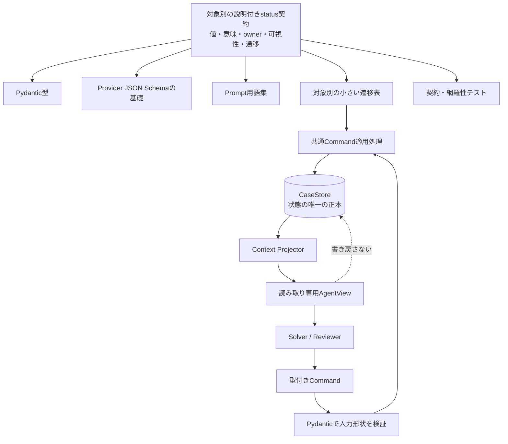

役割を混ぜないことも保守性に効く。

| 部品 | 担当すること | 担当しないこと |
|---|---|---|
| Pydantic型 | 入出力の形、型、必須項目 | 状態を変更してよいかの判断 |
| 遷移表・Command適用処理 | 許可された状態変更、既知ID、構造整合 | 法的な意味判断 |
| Projector | CaseStoreから用途別AgentViewを作る | 第二の正本、status更新 |
| Solver | どのCommand・意味statusを選ぶか | CaseStoreへの直接書込み |
| 契約テスト | 未定義の遷移、schema・Prompt生成漏れを検出 | Solverの法的判断の代行 |

例えばstatusへ新しい値を追加するときは、説明付き契約と必要な遷移、保存形式を変える。そこから型、schema、
Prompt用語集を更新し、未定義の組合せはテストで失敗させる。関連ファイルを記憶頼みで探して同じ文字列を
書き足す運用には戻さない。

型付きCommandだけですべての規則を保証するわけではない。Command固有のpayloadは型で分けるが、複数Commandで
共通するCase更新やfrontier更新は、現在状態との組合せを共通適用処理と契約テストで検証する。

すべてを巨大な共通Enumや一つの状態機械へまとめるわけではない。Run、Tool、Cycle、Step、WorkItem、
Hypothesis、Frontierごとに小さい契約を持ち、共通の生成・適用方法だけを揃える。

## 12. 現在の3系統と切替先

現行コードには3系統ある。新しい設計へ統合するときに、`agent_core/`を新Frameworkの一部と誤認しない。

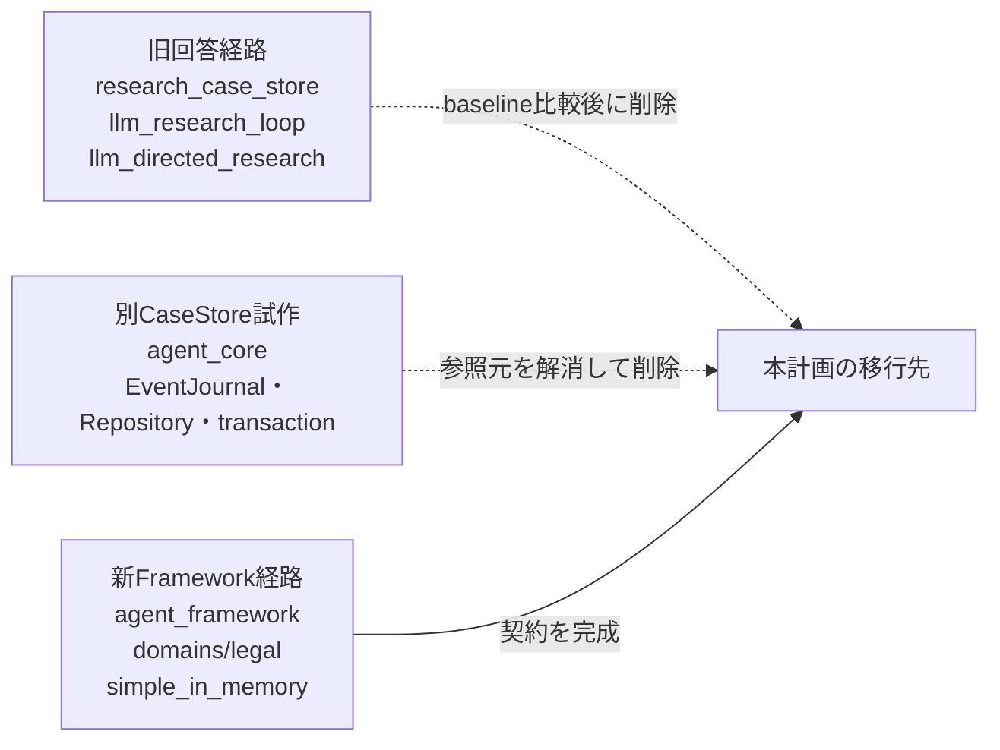

`framework_agent.py`は新Framework用の`simple_in_memory.py`を使用し、`agent_core/`を直接使わない。
`agent_core/`は現在`llm.py`等から参照されているため未接続ではないが、EventJournalや疑似transactionを
初期実装へ持ち込まず、参照を解消してから削除する。
