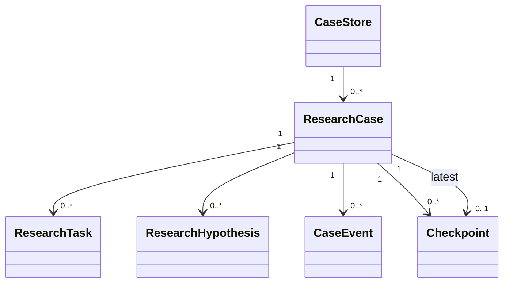
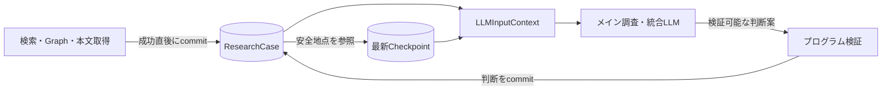

# LLM主導法令調査の案件状態・Checkpoint再設計 実装計画

> 状態: 新規実装ロードマップとしては`generic_iterative_agent_framework_plan.md`に置き換えられた。
> 本書は移行完了まで、現行`ResearchCase`実装の背景・対応確認用資料として参照する。

## 1. 目的

現行のLLM主導方式は、各サイクル末尾の統合LLMが`ResearchCheckpoint`全体を
再生成する。検索・Graph展開・本文取得が成功しても、統合がタイムアウトすると
発見済みArticleや未取得本文の引継ぎが欠けることがある。

本改修では、LLMの会話履歴を正本にせず、1利用者質問を起点とする調査案件を
`ResearchCase`として管理する。ツールで確認した事実は直ちに案件へ確定し、
`Checkpoint`は安全な判断地点と再開用参照だけを保持する。

## 2. 用語と多重度



- `CaseStore`: 複数案件を保存する抽象的な保存機構。
- `ResearchCase`: 1利用者質問と、そこから分解された論点・Claim・Task・証拠を
  含む調査全体。確認済み事実と進捗の正本。
- `ResearchTask`: 検索、本文取得、Graph展開、根拠評価などの作業単位。
- `ResearchHypothesis`: 検索前の暫定結論を平坦な配列要素として保持する。要素は
  `hypothesisId / statement / status / evidenceIds / missing`だけを持ち、Taskは
  `hypothesisIds`で検証対象を参照する。
- `CaseEvent`: 案件に対する確定済み更新の監査記録。
- `Checkpoint`: 特定の`ResearchCase.version`を参照する、不変の安全な判断地点。

履歴上のCheckpointは複数存在するが、通常の再開に使用するのは最新の1件だけとする。
案件が未完了でも、確定済み判断と未完了Taskを参照する`continue` Checkpointを作れる。

## 3. 正本と参照の分離



ResearchCaseはArticle、Evidence、Graph関係、Task、Hypothesis、Claim、更新履歴を保持する。
Checkpointは本文や全検索履歴を複製せず、案件version、判断状態、採用Evidence、
未完了Taskへの参照を保持する。

次回入力は次の和集合から作る。

```text
最新Checkpointの判断状態
+ Checkpoint.storeVersionより後に確定したCaseEvent
+ 現在の未完了・候補ResearchTask
+ 今回判断するために必要な取得済み本文とGraph関係
```

## 4. トランザクション境界

1サイクル全体を1トランザクションにしない。次の小さい単位で確定する。

1. Action登録
   - ResearchTask作成または既存候補Taskの昇格
   - `pending -> running`
2. ツール結果確定
   - Article・Evidence・Graph関係の登録
   - Taskを`completed | failed`へ更新
   - Graphで発見した本文未取得Articleの候補Task作成
   - Taskに紐づくHypothesisへ試行Taskと観測Evidenceを記録
3. LLM判断確定
   - 既知IDと状態遷移を検証
   - Hypothesisの支持・反証・根拠不足とEvidence評価、Claimを更新
4. Checkpoint確定
   - ResearchCaseの現在versionを参照するCheckpointを追加
   - latestCheckpoint参照を同時更新

統合LLMをトランザクションに含めない。統合がタイムアウトした場合、新しい
Checkpointは作成しないが、それ以前に確定したArticle・Evidence・Taskは残す。

## 5. Task実行方針

初期実装は直列とし、同時に`running`となるTaskは最大1件とする。LLMが複数Actionを
提案した場合も、各ActionをTaskとして登録し、1件ずつ開始・実行・確定してから次へ進む。

Taskの詳細と現在状態はResearchCaseを正本とする。Checkpointの`pendingTaskRefs`は
作成時点の再開意図であり、次のTaskは現在のResearchCaseにある実行可能Taskから選ぶ。

実装では、Checkpointが確定した`pending` Taskを次サイクルのLLM判断より先に直列実行する。
一括`fetch_articles`で本文を取得した場合は、同じArticleを指す既存の個別候補Taskも
同じ案件versionで`completed`へ同期し、取得済みArticleを未処理として再提示しない。
LLMへ提示する候補Taskは、確定済み`pending`を優先し、Graph候補は対象法令ごとに
ラウンドロビンして、一つの法令が表示上限を独占しないようにする。

## 6. LLMとの契約

LLMへCaseStore全体を渡さず、呼び出しごとの`LLMInputContext`を生成する。

- 現在の暫定結論と中心Claim
- 現在のHypothesis配列と、根拠ID・未確認事項
- 最新Checkpoint以降の確定済み差分
- 未完了Taskと、Graph由来候補Task
- 今回判断する取得済み本文
- 関係する確認済みGraph関係

ツール結果の取得状態はプログラムが更新する。LLMは法的関連性、根拠採否、追加調査、
回答可能性を判断する。LLMが出力したDB IDは引き続き既知集合との完全一致で検証する。

現行の巨大な全カタログenumは、呼び出しで実際に提示するEvidence、Checkpoint参照、
未完了Task対象に限定する。これにより安全性を維持しながらSchema入力を削減する。

## 7. Checkpointの整合条件

- `checkpoint.storeVersion <= researchCase.currentVersion`
- Checkpoint参照は`storeVersion`時点で存在する
- Checkpoint作成時に`running` Taskがない
- latestCheckpointは案件ごとに最大1件
- Checkpoint後のCaseEventを次回入力から除外しない
- `ready`は取得済みEvidenceを少なくとも1件参照する
- `ready`時にHypothesisが`unverified | partially_supported`のまま残らない
- `unverified`以外のHypothesisは検証に使った取得済みEvidenceを参照する
- `ready`時にLLM自身が`nextArticleIds`または本文確認の未解決事項へ残したArticle、
  あるいは既存`pending` Taskがあれば次サイクルへ戻す。単なるGraph候補はLLMへ提示するが、
  プログラムが自動的に必須根拠へ格上げしない。
- `ready`と中心的な未解決事項が同居した統合結果は、内容と次Taskを捨てず`continue`へ降格する。
- 回答用根拠はCheckpointの`evidenceIds`だけでなく、Claimが参照する`text_verified`
  根拠ノードの代表本文と、同じArticleの補完項号から文書横断で組み立てる。
- 本文未取得のArticleをEvidenceとして扱わない

## 8. 実装フェーズ

2026-08-13時点でPhase 1のコード・判断契約・回帰テスト定義まで実装済みである。
この記載は動作検証済みという意味ではない。検証実行は別工程として保留する。

### Phase 1（今回）

- プロセス内`CaseStore / ResearchCase / ResearchTask / CaseEvent / CheckpointRecord`
- ツールActionの直列Task化
- ツール成功直後のArticle・Evidence・Graph関係・候補Task確定
- 最新Checkpoint後の差分と未完了TaskをLLM入力へ追加
- 有効な統合結果だけをCheckpointとして保存
- 統合タイムアウト後も未取得Article候補と取得済み本文を次サイクルへ提示
- JSON SchemaのID集合を呼び出し単位へ限定
- traceへversion、Checkpoint、Task状態、イベントを出力
- 仮説・検証結果のCaseStore保存、Action/Task/EvidenceとのID連携
- 各サイクルを仮説作成、識別証拠の取得、支持・反証比較、仮説更新としてPromptへ明示
- Actionには検証対象のhypothesisIdsを必須とし、未知ID・根拠のない状態更新を拒否
- `missing`や見出し類似からプログラムが法的必要性を推測する自動昇格を行わない

### Phase 2（Phase 1実測後）

- LLM出力をCheckpoint全体再生成から判断差分へ変更
- リクエスト内の短いArticle/Evidence参照を導入
- 必要な場合だけメイン配下のサブ調査エージェントを直列起動

### Phase 3（運用要件が生じた場合）

- Redis等による複数プロセス間の実行中状態共有
- PostgreSQL等による長期保存・監査・案件再開
- 独立Taskの並列実行とlease/version競合制御

## 9. 検証

- Taskが同時に2件`running`にならない
- Action成功・失敗がTask状態と同じversionで記録される
- Graphで発見した本文未取得Articleから候補Taskが作られる
- 検索・Graph候補が起点ActionのhypothesisIdsを継承する
- 中心Hypothesisが根拠不足なら`ready`を拒否する
- 統合タイムアウト後も候補Taskと取得済みEvidenceが次サイクル入力に残る
- Checkpointは統合成功時だけ増える
- 最新Checkpoint後の差分がLLMInputContextへ含まれる
- 未提示・未知IDはツール実行とCheckpointへ入らない
- Sonnetで自然言語Level 3の3問を実行し、必要条文到達、回答要点、時間、
  統合タイムアウト、サイクル別新規Evidenceを比較する
