# シンプルな汎用反復型エージェント基盤 実装計画 — 視覚ガイド

> 対応する実装計画:
> [`generic_iterative_agent_framework_plan.md`](generic_iterative_agent_framework_plan.md)
>
> 本書は人間が構造と処理を理解するための図解である。型、制約、status、実装Phase、完了条件の正本は
> 対応する実装計画とする。

## 1. 全体像

登場人物を増やさず、意味判断はSolverへ集約する。ProjectorはLLMではなく、保存状態から入力を作る
決定的な処理である。

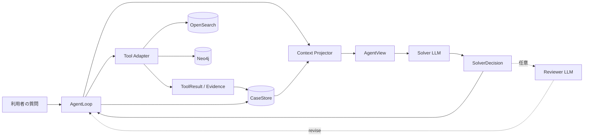

| 要素 | 一言でいうと |
|---|---|
| CaseStore | 案件の正本 |
| Context Projector | 正本から、今回LLMへ見せる情報を取り出す処理 |
| AgentView | Solverへ渡す読み取り専用の入力 |
| Solver | 仮説、検索、関連性、根拠、完了を判断するLLM |
| AgentLoop | 呼出し、保存、予算、構造検証を進めるプログラム |
| Tool Adapter | Solverの検索要求を固定されたbackend操作へ変換する処理 |
| Reviewer | 有効時だけ最終回答案を検査するLLM |

## 2. CaseStore、Projector、AgentViewの関係

同じ情報を三重に保存する構造ではない。CaseStoreだけが正本で、AgentViewは呼出し用途ごとに作り直す。

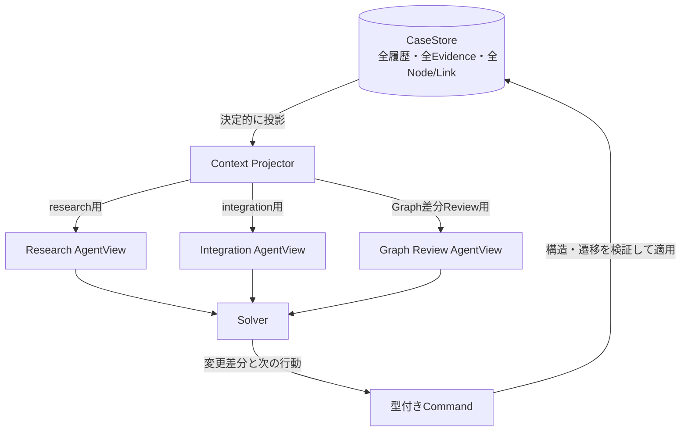

Projectorは関連性を選ばない。本文枠、安定順、既知ID、現在の処理モードなど、契約で決められた条件だけで
表示を組み立てる。

## 3. WorkItem、Hypothesis、探索の関係

問いの分解と情報源の探索を別構造にする。

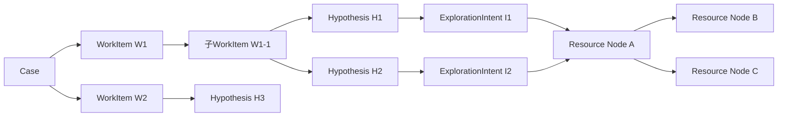

- WorkItemは「何を解くか」の階層である。
- Hypothesisは「本文で何を確かめるか」である。
- ExplorationIntentは「その確認のため、どの範囲をどう検索するか」である。
- Resource Nodeは情報源そのもので、同じArticleは案件内で1件に正規化する。
- DiscoveryLinkは発見経路であり、同じNodeへ複数残せる。
- Frontierは`Node × Hypothesis`単位なので、H1で不要でもH2で必要になり得る。

## 4. 1 Cycleの流れ

1 CycleはTool 1回やGraph 1ホップではない。1つの仮説・探索方針を、複数Stepで検証して評価する単位である。

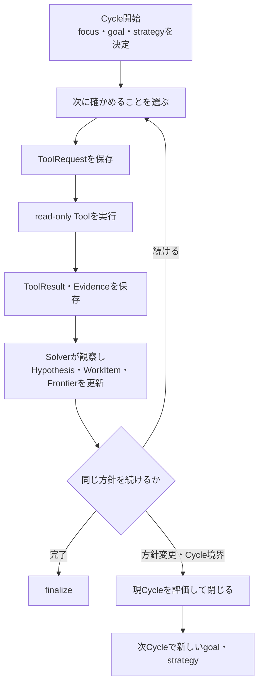

Legal Profileでは1 CycleのArticle本文取得を累計4件以内、Graph候補から1 Stepで選ぶ本文を3件以内、
Research Cycleを最大4回とする。上限値は目標ではなく、暴走防止の機械的制約である。

## 5. OpenSearchとNeo4jの使い分け

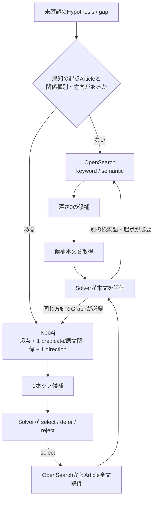

Neo4jは本文の保管場所ではない。Graphで候補Article IDと関係を発見し、本文はOpenSearchからArticle単位で
取得する。Graph候補だけを根拠として採用しない。

## 6. Graph候補と本文取得は別の状態

候補の関連性と本文取得の成否を1つのstatusへまとめない。

| Graph候補のReview | 意味 | 本文statusとは独立 |
|---|---|---|
| `unreviewed` | 現Hypothesisでは未評価 | 本文取得済みの場合もある |
| `selected` | Solverが今回の本文取得対象に選んだ | 取得成功を意味しない |
| `relevant_deferred` | 関連するが今回の枠外 | 次Step・次Cycleへ残す |
| `rejected` | 現Hypothesisでは不要とSolverが判断 | 別Hypothesisへ自動転用しない |

| 本文status | 意味 |
|---|---|
| `not_requested` | 未要求 |
| `pending` | 要求済み、結果待ち |
| `succeeded` | OpenSearchに登録済みの当該Article全chunkを取得完了 |
| `failed / timeout` | 全chunkを取得できず失敗または時間切れ |

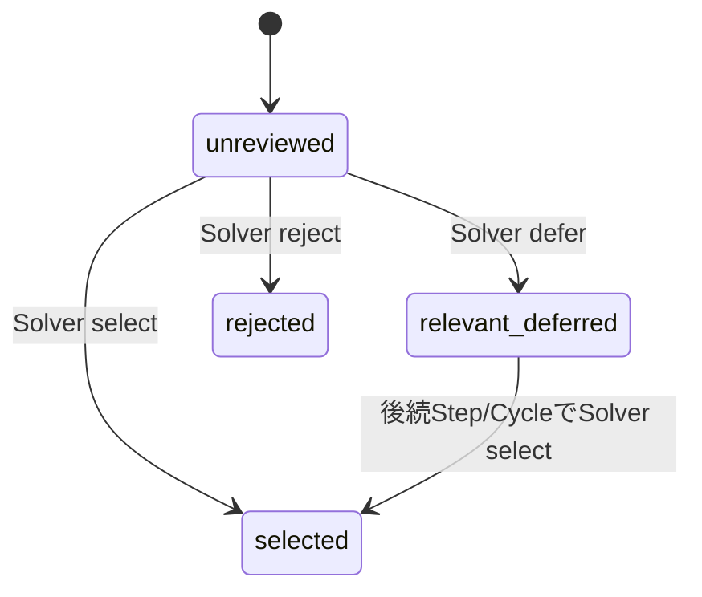

`rejected`を別Hypothesisで使う場合、元のFrontierを書き換えない。Solverの明示的な再採用により、同じNodeと
別Hypothesisの組合せで新しい`unreviewed` Frontierを作る。

## 7. Cycle間の引継ぎ

Cycle 1の最後にCycle 2の詳細計画まで作らない。Cycle 1は自分の結果と未解決事項を確定し、Cycle 2が
引き継いだ状態を見て新しい計画を作る。

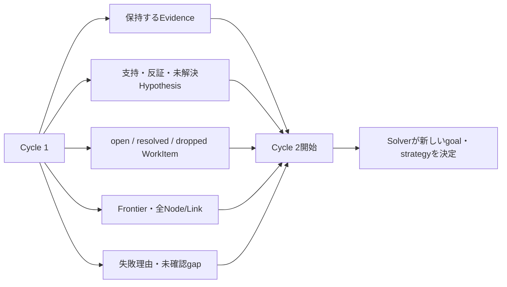

引き継がないものは、過去のLLM生応答、同じ本文の重複コピー、次Cycleに固定された検索queryである。

## 8. 非同期Relation分類

回答時のSolverとは別のオフライン処理である。Programは候補を作り、法的意味の分類はLLMが行う。

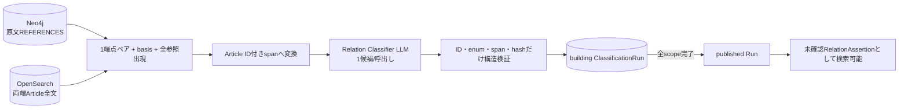

複数候補を同じPromptへ束ねない。保存checkpointのbatchとLLM入力のbatchは別であり、1候補ずつでも
再開できる。

## 9. 共有法令Graphの形

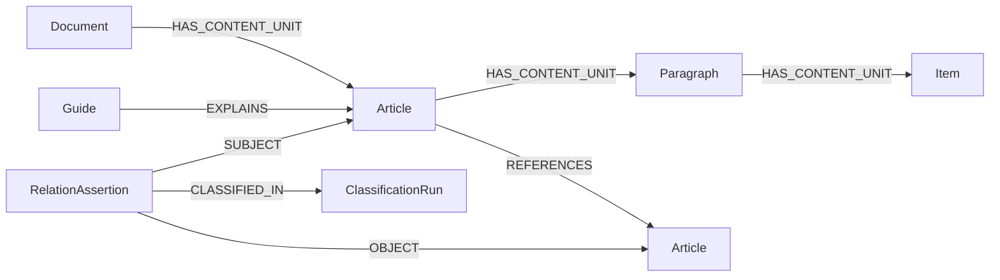

`IMPLEMENTS / INCORPORATES / USES_DEFINITION / EXCEPTION_TO / OVERRIDES`は物理Edgeではなく、
RelationAssertionの`proposedPredicate`である。RelationAssertionは共有候補であり、案件で確認済みの正式関係ではない。

## 10. 保守性向上のコンセプト

根幹は、statusの値を隠すことではなく、**定義と更新経路を一か所にすること**である。
各ファイルが同じstatus一覧や遷移条件を持つと、一つの値を変更するたびにPrompt、schema、validator、Loopの
修正漏れが起きる。正本から派生物を作り、状態変更を一つの入口へ集約する。

| 従来起きやすかった問題 | 新しい考え方 |
|---|---|
| 同じstatusを複数ファイルへ手書きする | 対象別の説明付きstatus契約を唯一の定義元にする |
| `next`と別のフラグの組合せで動作を表す | `StartCycle`等の型付きCommandを1つだけ返す |
| Loopやvalidatorがそれぞれstatusを直接変更する | 共通Command適用処理だけがCaseStoreを更新する |
| PromptとProvider schemaの更新を忘れる | status契約から用語集とschemaの基礎を生成する |
| AgentViewを別の保存状態として扱う | ProjectorがCaseStoreから毎回再生成し、書き戻さない |
| 保存済みCaseへ新しい値を突然適用する | `contract_version`とmigrationを同じ変更単位で用意する |

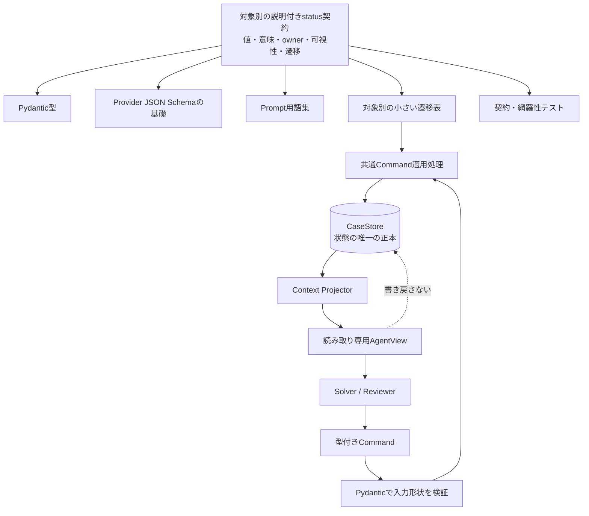

役割を混ぜないことも保守性に効く。

| 部品 | 担当すること | 担当しないこと |
|---|---|---|
| Pydantic型 | 入出力の形、型、必須項目 | 状態を変更してよいかの判断 |
| 遷移表・Command適用処理 | 許可された状態変更、既知ID、構造整合 | 法的な意味判断 |
| Projector | CaseStoreから用途別AgentViewを作る | 第二の正本、status更新 |
| Solver | どのCommand・意味statusを選ぶか | CaseStoreへの直接書込み |
| 契約テスト | 未定義の遷移、schema・Prompt生成漏れを検出 | Solverの法的判断の代行 |

例えばstatusへ新しい値を追加するときは、説明付き契約と必要な遷移、保存形式を変える。そこから型、schema、
Prompt用語集を更新し、未定義の組合せはテストで失敗させる。関連ファイルを記憶頼みで探して同じ文字列を
書き足す運用には戻さない。

型付きCommandだけですべての規則を保証するわけではない。Command固有のpayloadは型で分けるが、複数Commandで
共通するCase更新やfrontier更新は、現在状態との組合せを共通適用処理と契約テストで検証する。

すべてを巨大な共通Enumや一つの状態機械へまとめるわけではない。Run、Tool、Cycle、Step、WorkItem、
Hypothesis、Frontierごとに小さい契約を持ち、共通の生成・適用方法だけを揃える。

## 11. 現在の3系統と切替先

現行コードには3系統ある。新しい設計へ統合するときに、`agent_core/`を新Frameworkの一部と誤認しない。

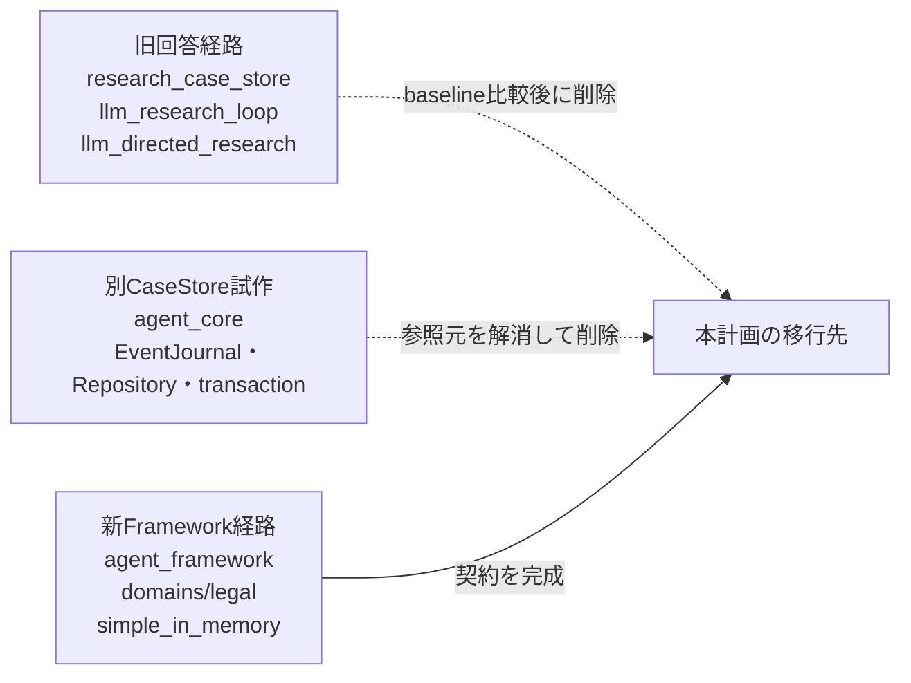

`framework_agent.py`は新Framework用の`simple_in_memory.py`を使用し、`agent_core/`を直接使わない。
`agent_core/`は現在`llm.py`等から参照されているため未接続ではないが、EventJournalや疑似transactionを
初期実装へ持ち込まず、参照を解消してから削除する。
