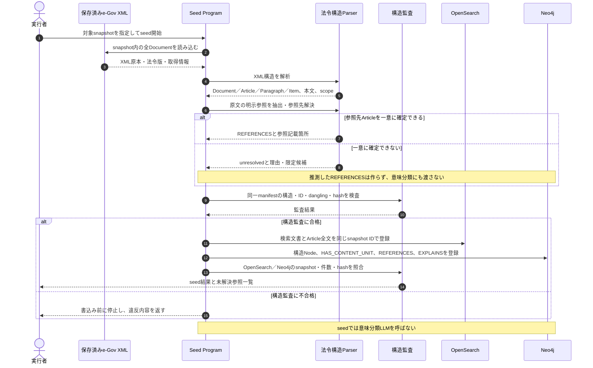
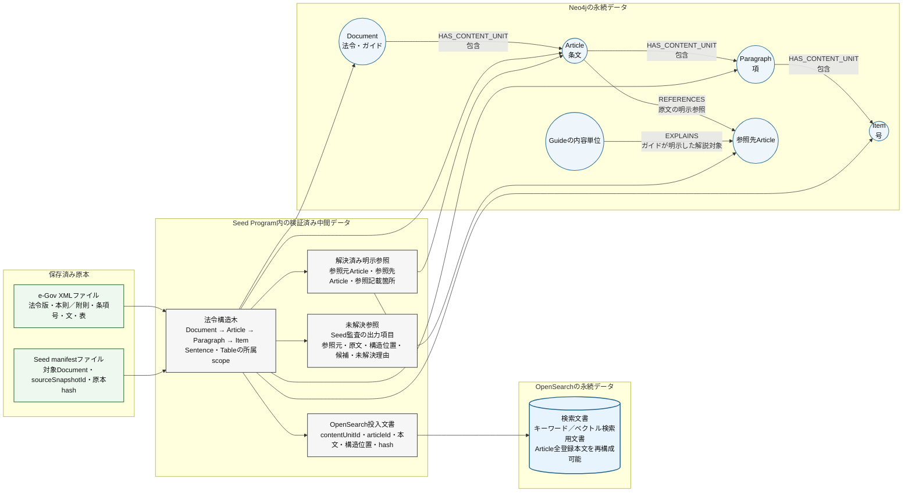
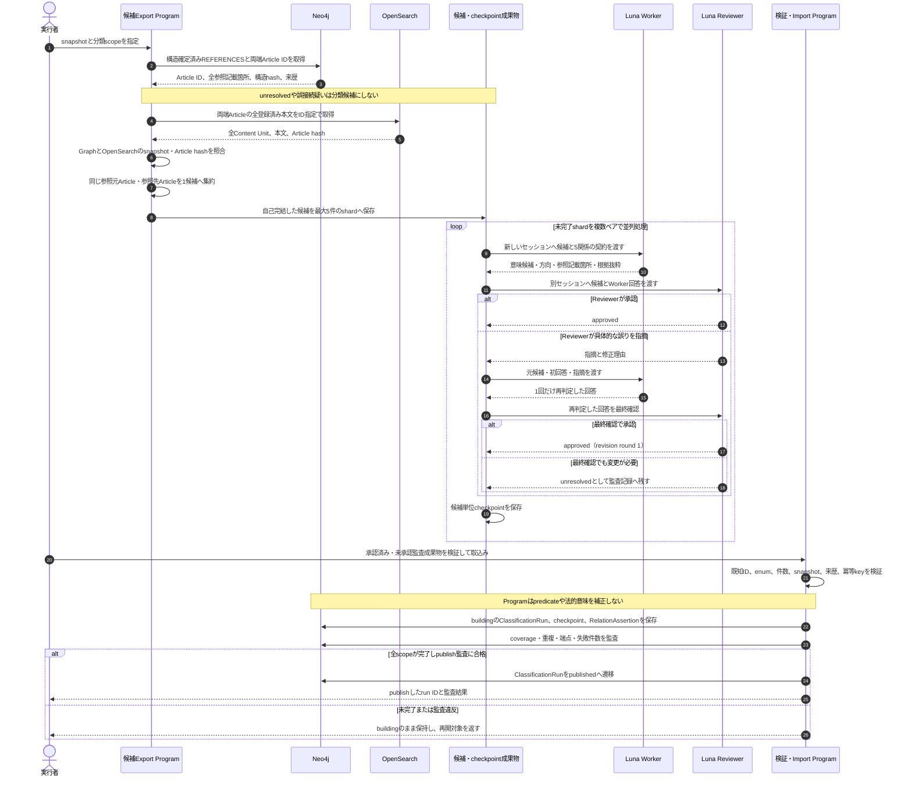
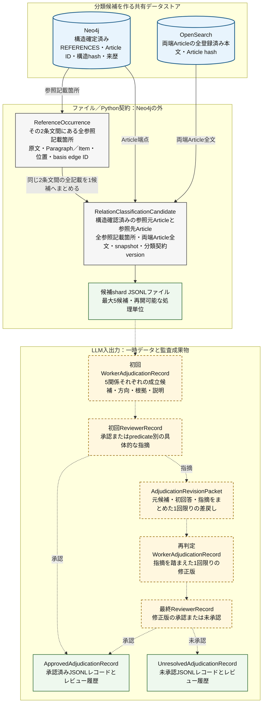
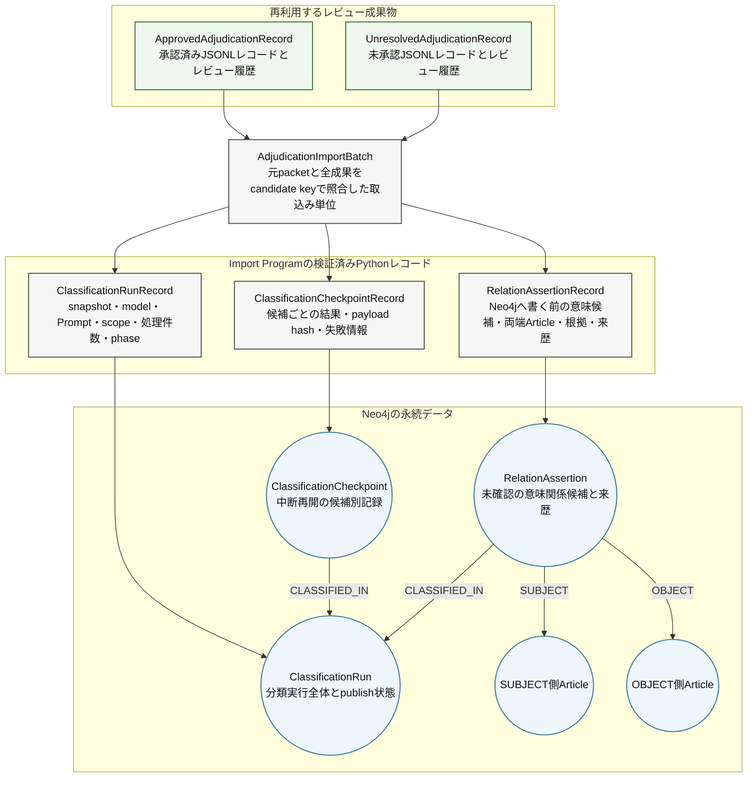
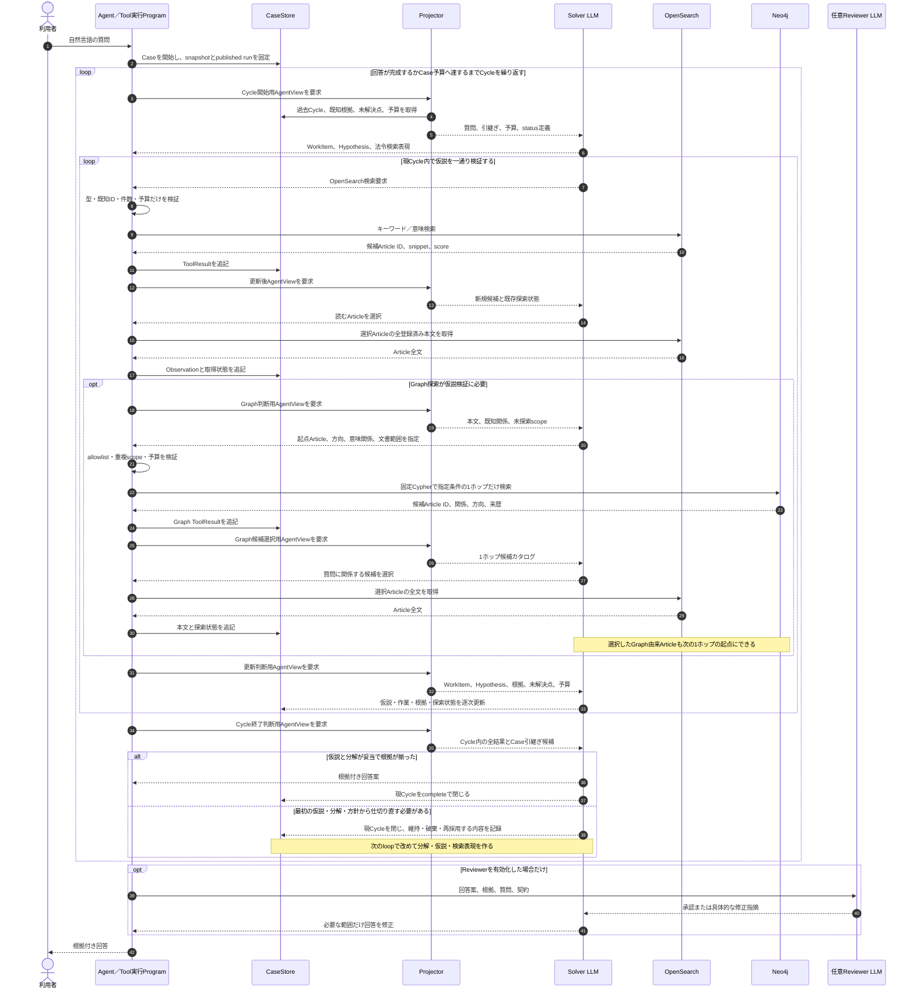
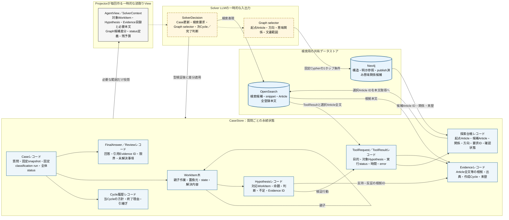

# 第二期開発 備忘録

> 更新日: 2026-08-23
> 状態: 再計画の方向性を忘れないための短いメモ。詳細契約・完了条件の正本ではない。

本書の「第二期開発」は、この法令検索プロジェクトを再計画した次の開発期間を指す。
Agent Frameworkの`Phase 2`や、AWS移行の`step2_transition_plan.md`とは別である。
詳細化後は[汎用反復型Agent実装計画](generic_iterative_agent_framework_plan.md)へ反映する。

## 1. 第二期の目的

法令検索の価値を、次の2点で検証する。

1. 利用者の質問を、漏れの少ない検索仮説と法令検索表現へ変換できること。
2. その仮説に沿って、上位・下位の法令や例規をたどれるデータストアと検索処理を持つこと。

主な利用者像は自治体職員とする。上位法令の改正を起点に、関係する条例、規則、要綱を探し、
改正要否の確認へつなげる利用を中心に考える。自治体例規を取得できない間は、構造の近い小規模な
法令集合で仕組みを検証する。第二期Step 1では、保存済みe-Gov XMLから作る公開買付け3階層
ミニデータセットを使用する。

## 2. 第一期からの重要な変更

| 観点 | これまでの問題 | 第二期の方向 |
|---|---|---|
| データセット | 4,000超の法令を先に扱い、意味分類の時間と費用が大きくなった | 小規模な対象で検索仮説と検索経路を先に検証する。全件成果は再開可能な状態で保存する |
| 検索語 | 利用者の「必要な手続」等をそのまま検索し、法令上の表現へ十分に変換できなかった | Solverが仮説から「公告」「届出書」「提出」等の法令検索表現を作る |
| 検索仮説 | 手続、例外、定義、委任先等の観点が抜けることがあった | 基本観点を仮説作成時のチェックリストにする。全項目の探索は強制しない |
| Graph実行 | 本文取得後にProgramが固定関係を自動検索した | SolverがHypothesis、起点条文、方向、探す意味、文書範囲を明示する |
| Graphの連鎖 | Graphから見つけた条文を次の起点にできず、下位法令への探索が1ホップで止まった | 1回のGraph呼出しは1ホップに限定し、LLMが選んだ条文は次の1ホップの起点にできる |
| 検索爆発 | 逆引き`REFERENCES`を広く取得し、LLMへ大量候補を渡した | 逆引きはpublish済み意味関係と仮説selectorでNeo4j側から絞る |
| 法令構造 | 平坦化本文だけでは本則、附則、改正法、表、項・号の参照先を取り違え得る | 保存済みe-Gov XMLの構造を正本とし、検索用本文は派生物として扱う |
| 意味分類 | 全件を繰り返し分類すると費用がかかる | snapshot単位で一度分類し、checkpointと成果を再利用する |
| Agent構成 | 役割追加により契約とPromptが複雑化しやすかった | 回答AgentはSolverと任意Reviewerだけにする。Reviewerは既定無効 |
| 保守性 | status、schema、Promptが分散し、変更時に修正漏れが起きた | 型付き契約を正本にし、Provider schemaとPrompt用語集を同期する |
| LLM入出力の確認 | Prompt部品、動的入力、Provider schemaが別々の場所にあり、実際の呼出し内容を事前に照合しにくかった | 固定指示、実行時入力、最終出力契約を分離し、実際のAPI要求と対になる成果物を決定的に出力する |

### 2.1 Prompt・契約の最終成果物

同じ処理モード、Provider輸送方式、契約versionでは、LLM呼出しごとに指示本文を作り変えない。
役割、手順、判断基準、出力ルール、契約用語集、輸送ルールは固定指示として組み立て、同じ
`instructionsHash`を持たせる。質問、検索結果、Evidence、残り枠、許可ID、候補別名、契約違反は
実行時入力とする。修復時も、固定の修復指示へ違反内容と直前出力を入力として渡し、違反ごとの
指示文をPythonで組み立てない。

```text
固定の指示
├─ 役割
├─ 手順と判断基準
├─ 契約項目の意味
└─ Provider輸送ルール
          ＋
実行時入力
├─ 質問・現在の状態
├─ 検索候補・取得済みEvidence
├─ 許可ID・残り枠
└─ 修復時だけ違反内容・直前出力
          ＋
最終出力契約
└─ Providerへ実際に渡すJSON Schema
          ↓
LLM API要求
```

各LLM呼出しについて、実際の送信処理と同じレンダリング結果から次を出力する。

| 成果物 | 内容 |
|---|---|
| `instructions.md` | その処理モードで使う固定指示。動的な検索結果やEvidenceを含めない |
| `input.json` | 今回の質問、状態、検索結果、Evidence、許可値、修復情報 |
| `output_schema.json` | Providerへ実際に渡す最終JSON Schema |
| `normalized_schema.json` | Provider応答の正規化後にPydanticで検証する共通契約 |
| `request.txt` | Provider制約により連結・直列化した、実際のAPI送信内容 |
| `manifest.json` | 処理モード、Provider、Profile/version、Prompt asset、各hash |

成果物出力のためにLLM APIは呼ばない。通常実行の成果物は`eval-results/`へ保存してGit管理外とし、
固定した代表fixtureから作る基準成果物だけをGit管理する。成果物は手編集せず、Prompt asset、Pydantic契約、
Projectorが作る入力から再生成する。API送信処理と成果物出力処理が別々にPromptやschemaを組み立ててはならない。

第二期Step 1では、research、検索候補評価・取得選択、Graph候補評価、Evidence統合、Cycle終了・最終化、
契約修復、任意Reviewerの代表入力を対象にする。OpenAI、Anthropic、Ollamaの各輸送方式について、
実送信内容と成果物のPrompt・schema・hashが一致することをテストする。

既存fixtureは、現行の型で再投影できるだけでは維持理由としない。現在の処理境界、Promptまたは契約の
固有の回帰を再現するものだけを残す。新しい代表成果物または小さい単体テストで同じ問題を再現できるもの、
古いProfileのPrompt文言を固定するだけのもの、修正済み輸送形式しか表さないものは削除する。

### 2.2 第二期Step 1：公開買付け3階層ミニデータセット

Step 1では、`datasets/scenarios/public_tender_offer_three_layer_v1/`を固定入力として、
「法律→施行令→府令」の連続1ホップ探索を実装・検証する。架空条文やgold本文は作らず、既に保存した
4法令のe-Gov XMLから本則Article全文を選ぶ。公開買付け3階層の13 Articleに加え、少人数私募の
告知根拠をたどるため、開示府令14条の15と金商法23条の13を含める。

| 法令 | 対象Article | 主な検証目的 |
|---|---|---|
| 金融商品取引法 | 27条の2、27条の3、27条の4 | 公開買付け義務、公告・届出、比較候補 |
| 金融商品取引法施行令 | 6条、7条、8条、9条の3 | 対象、適用除外、期間、公告の周辺規定 |
| 公開買付府令 | 2条の4、2条の5、2条の6、9条、10条、11条 | 少数所有者の条件、公告事項、隣接候補 |

検索・seed入力は`manifest.json`、`article_allowlist.json`、保存済みXMLだけとする。
`eval/`の期待参照、意味関係、質問別必要Articleは採点専用であり、OpenSearch、Neo4j、Solver Prompt、
意味分類LLMへ渡さない。対象外Articleへの参照は`outside_dataset_scope`として監査し、別Articleへの補正や
dangling edgeを作らない。

Step 1の代表経路は次とする。

```text
金商法27条の2 ── IMPLEMENTS ──→ 施行令7条
金商法27条の2 ← EXCEPTION_TO ── 施行令7条
施行令7条     ── IMPLEMENTS ──→ 公開買付府令2条の5
金商法27条の3 ── IMPLEMENTS ──→ 公開買付府令10条
```

金商法27条の2と施行令7条は、委任具体化と例外という別々の必要条件を満たすため、2つの意味候補を
併存させる。複数predicateから同じArticleへ到達しても、本文取得はArticle IDで1回にまとめ、
Hypothesisごとの到達理由はDiscoveryLinkとして別々に残す。

Step 1の実行順と完了条件は次のとおり。

1. 保存済みXML hash、Article全体、明示参照、gold分離、subset snapshotをローカルvalidatorで検証する。
2. 条・項・号の構造保持、参照抽出、Graph schemaまたは投入ロジックを変更した後、同じsnapshotから
   OpenSearchとNeo4jを両方再構築する。Neo4jの現行データは消去してよいが、片方だけの更新は成功としない。
3. 小規模対象だけを非同期意味分類し、publishする。採点用期待値を分類入力へ混ぜない。
4. 検索Agentの各LLM呼出しについて、固定指示、実行時入力、最終出力契約、実送信内容を生成し、
   Promptと契約を人間が対で確認できる状態にする。
5. OpenSearch検索、仮説selector、連続1ホップGraph探索、Article全文取得を3つの代表質問で検証する。
6. trace上で必要Articleへの到達、重複本文取得の不在、対象外参照の扱い、OpenSearch／Neo4jの
   `datasetSnapshotId`一致を確認する。

インデックス構築前のデータセット検証コマンドは次である。

```bash
python3 scripts/validate_public_tender_offer_mini_dataset.py
```

2026-08-21時点の旧snapshotでは、全件ではなく3法令13 Articleのsubsetだけを再indexした。
専用OpenSearch indexは69文書、Neo4jは3 Document、13 Article、46 Paragraph、20 Item、
100構造Relationである。17分類候補は
Luna Worker / Reviewerで17/17承認され、24 RelationAssertionを
`classification-run-public-tender-mini-v1-v23`としてpublishした。固定selectorの直接確認では、
金商法27条の2から施行令7条、施行令7条から府令2条の5、金商法27条の3から府令10条へ到達できる。

回答経路はLegal Profile v98で、Graph要求を1ホップ、Graph由来Articleを後続stepの起点として許可する。
本文取得後の下位規範チェックリストは、法的根拠をHypothesis / Evidenceへ一本化し、監査statusと
追加ToolRequest参照だけをDependencyDecisionへ保存する。Gemmaは本文取得・完了判断が安定せず、Haikuは
必要本文取得まで進んだが、v53への簡素化後も検索候補を本文根拠へ誤用する修復不備が残った。v54では
navigation-only Evidenceを根拠にせず本文取得へ戻す指示と、継続可能なopen WorkItemを残したfinalizeを
修復schemaで許可しない制約を追加した。v55では、この修復で要求する本文を1 Request、残りCycle枠内へ
まとめる指示も追加した。
v56では、Article全文を構成する全Paragraph / ItemをHypothesis根拠へ入れたまま一部だけ引用する不整合を、
LLMが根拠選択を再評価して修復できるようにした。Haiku、Reviewer offの
`公開買付けによらない主な場合`は1 Cycleで完了し、必要Article 3/3、回答観点3/3へ到達した。
複合的な全体問題では180秒内に契約修復後の統合を完了できなかったため、v57で全体上限を240秒へ変更した。
契約修復用の通常時間を使い切った場合は即時失敗せず、予約済みの最終化時間へ制御を戻す。
Anthropicでは配列の`maxItems`がprovider schemaから除かれるため、Promptだけでは4 Article上限を
繰り返し超過した。v58では本文取得を最大4個の固定slotを持つ単一`article_fetch`として受け取り、
LLMが選んだIDをAdapterが1件の`fetch_articles`へ復元する。ProgramはArticleを選び直さない。
v60ではその他のToolRequestを固定数のJSON object文字列slotで輸送し、Adapterで復元後に共通契約を
完全検証する。完全なToolRequest schemaをslotごとに複製する方式はAnthropicのgrammar上限を超えたため
採用しない。Legal初期値は検索系4要求と`article_fetch` 1要求を合わせた1 step最大5件で、本文取得量は
1 Request・1 Cycleとも最大4 Articleである。どのToolを各slotへ入れるかはLLMが判断する。
v64では、同じ下位法令の別Articleを委任事項の具体化規定として代用せず、委任元と末端の具体化規定を
それぞれ直接Evidenceで確認する規則を追加した。未取得Articleの内容を学習済み知識で補って完了してはならない。
また、`lower_norm=resolved`は委任元と末端の2つ以上の異なるArticle本文Evidenceを要求する。
Cycle境界ではAnthropic / compact輸送schemaも新規Tool slotを0件にし、共通契約のTool禁止を保持する。
当時のAnthropic輸送ではCaseUpdateのJSON文字列と、Hypothesisが選ぶEvidence IDの小さな構造化sidecarを分けた。
sidecarだけを提示済みIDへ制限してCaseUpdateへ機械転記し、CaseUpdate全体の構造化でgrammar上限を
超えることを避ける。ToolRequestも固定slotを維持する。v98では汎用slotのTool名だけを構造化して
`legal_search / legal_graph_neighbors / load_evidence`へ限定し、Request本体をJSON文字列で輸送する。
本文取得は専用slotだけに分け、短い候補別名を既知Article IDへ機械変換する。これにより本文取得経路の重複と、
長いArticle IDのenum反復によるAnthropic grammar肥大化を防ぐ。また、sidecarを今回更新する
Hypothesisだけへ限定し、選択可能な本文Evidenceがないときは`null`を返す。sidecarをEvidence選択の正本とし、
`update_json`内のEvidence IDを二重管理しない。また、本文取得済みArticleは再取得候補から外す一方、
既知のGraph起点としては保持する。本文取得候補とGraph起点の許可集合を同一視しない。
共通輸送Promptは差分更新の正確なフィールド名と状態整合を短く構造化し、契約修復時は該当違反だけを提示する。
以上はv58からv98までの経緯である。v154ではAnthropic専用の固定slot、候補別名、Evidence sidecarを
新規出力経路から外した。全Providerは処理段階別の同じ小型schemaを使い、`update`、`tool_requests`、
実Article / Evidence IDを直接返す。実行時IDはschema enumへ反復せず、共通validatorが既知性、件数、
重複、参照整合を決定的に検証する。Provider AdapterにはAPI形式とschema方言だけを残す。
ただし、この実行はOpenSearchだけで金商法27条の2、施行令7条、府令2条の5を発見し、Graph要求は0件だった。
固定selectorの直接Tool確認とは別に、OpenSearchだけでは下位Articleを発見できない質問で、Solverが
Graph由来Articleを次の1ホップ起点にするE2E試験を残す。これを確認するまで全件へ戻らない。

2026-08-21のHaiku・Reviewer off実測では、v94の例外問題は必要Article 3/3・回答観点3/3、公告問題は
必要Article 2/2・回答観点4/4へ到達した。v96の総合問題ではCycle 1の判断と選択Evidenceを保持したまま
Cycle 2の追加検索へ進み、Cycle間引継ぎを確認したが、Anthropic grammar上限で停止した。v98はその輸送問題を
解消したものの、総合問題はCycle 1で3 Articleを取得した後の引用契約修復中に240秒へ達し、gold必須Articleは
2/6だった。複数WorkItemの完了判断を含む第二期Step 1全体の完了条件はまだ満たしていない。

## 3. 目標とする検索の流れ

```text
利用者の質問
    ↓
WorkItemへ分解し、検証するHypothesisを立てる
    ↓
Hypothesisを法令検索表現へ変換する
    ↓
OpenSearchで候補条文を発見する
    ↓
候補のArticle全文を取得し、Solverが評価する
    ↓
Graphが必要なら、Solverが仮説に沿ったselectorを指定する
    ↓
Neo4jから指定条件の1ホップ候補だけを取得する
    ↓
Solverが候補を選び、OpenSearchからArticle全文を取得する
    ↓
必要なら、選んだArticleを次の1ホップ検索の起点にする
    ↓
根拠が揃えば回答へ統合する
    ↓
最初の仮説・分解・探索方針が不適切ならCycleを閉じ、次Cycleで仕切り直す
```

Graph候補をProgramが自動再帰展開しない。検索爆発は累積ホップ数で一律に止めるのではなく、
1要求1方向・1関係、重複scope禁止、1 stepの候補数、本文取得数、Tool数、Cycle時間で抑える。

この方針は汎用実装計画へ反映済みである。`minimum_depth`は監査・可視化には残すが、Graph実行可否の
上限判定には使わない。

## 4. 処理別シーケンス図とデータ構造図

以下は第二期で目標とする処理境界を示す。各シーケンス図の直後に、その処理が読み書きするデータ構造を
対になる図として示す。円筒形は実際のデータストアであるOpenSearchまたはNeo4jだけに使う。円は
Neo4j内のNode、実線の箱はファイルまたはProgramが扱うレコード、破線の箱はLLM入出力等の一時データである。
CaseStoreは永続化先を切り替えられる抽象であり、特定のDBを表さない。`Program`は構造解析、型検証、保存、
予算管理を行うが、法令上の意味、質問との関連性、探索の優先順位は補完しない。

### 4.1 インデックス時



#### 対応するデータ構造



`Unresolved`は専用DBではなく、Seed Programが構造監査結果へ出力する中間データである。現時点では
永続化先を定義していないため、図でも円筒形にしない。再処理用に永続化する場合は、OpenSearchやNeo4jへ
有効な参照として混ぜず、seed manifestと対応する監査成果物の保存形式・保存先を別途定義する。
参照先が一意に確定するまでは`REFERENCES`にも意味分類候補にも変換しない。OpenSearch文書とNeo4j Nodeは
同じ`sourceSnapshotId`と共通IDで対応付けるが、それぞれ検索本文と関係探索という別の派生物である。

インデックス時の正本は保存済みXMLである。OpenSearchとNeo4jは同じsnapshotから一緒に再構築し、
意味関係の`RelationAssertion`はこの処理では作らない。限定候補をLLMで構造監査する場合も、seedや
意味分類へ混ぜず、`unresolved`を解消する独立工程として扱う。

### 4.2 意味関係の登録時



#### 対応するデータ構造

候補作成からレビュー完了までは、上から下へ次のように流れる。



レビュー成果物のImport契約とNeo4j上の保存構造は、次の別図で示す。



`RelationClassificationCandidate`等はファイルまたはPython上のデータであり、Neo4j Nodeではない。
Import Programが型・ID・来歴を検証した後、`RelationAssertionRecord`をNeo4jの
`(:RelationAssertion)`へ写す。`SUBJECT / OBJECT`は原文`REFERENCES`の向きをそのまま複製せず、
LLMが各predicateの意味方向として選んだArticleを指す。

意味登録は、構造的に正しいArticleの組に対してだけ行う。WorkerとReviewerは別セッションで、Reviewerは
Workerの回答を見て指摘し、差戻しは1回に限る。LLM成果物はまずファイルとcheckpointとして残し、
全scopeの監査に合格したRunだけを検索で利用できる状態にする。

### 4.3 検索時



#### 対応するデータ構造



CaseStoreは質問ごとの正本であり、Cycleが変わってもWorkItem、Hypothesis、Evidence、探索台帳を履歴として
保持する。Projectorはそれらを複製保存せず、その時点のSolverに必要な部分だけを`AgentView`へ投影する。
Solverは全Caseを再生成せず`SolverDecision`で差分を返し、Programが型・ID・予算を検証してCaseStoreへ
適用する。Graph候補の本文はNeo4jへ重複保存せず、選択後にOpenSearchからArticle単位で取得する。

検索時のProjectorは意味判断を行わず、CaseStoreから役割と時点に必要な情報を決定的に投影する。
OpenSearchは候補発見とArticle全文取得、Neo4jは仮説で限定した1ホップ候補の発見を担当する。
1回のGraph検索結果をProgramが自動展開せず、次の起点、検索方向、意味関係は毎回Solverが選ぶ。
Reviewerは既定で無効とし、有効な場合も新しい役割へ作業を分岐せずSolverへ具体的に差し戻す。

## 5. OpenSearchとNeo4jの役割

| 要素 | 役割 |
|---|---|
| 保存済みe-Gov XML | 法令版、本則・附則、条・項・号・文・表構造の正本 |
| OpenSearch | キーワード・意味検索、指定Articleの全登録済み本文取得 |
| Neo4j | 法令構造、明示参照、ガイド対応、非同期で付与した意味関係候補の1ホップ検索 |
| CaseStore | 質問ごとのWorkItem、Hypothesis、探索履歴、本文、根拠、Cycle引継ぎ |

本文の取得元はOpenSearchへ統一し、Neo4jから同じ本文を二重取得しない。Neo4jは候補Article IDと
関係・来歴を返し、回答根拠にする本文はOpenSearchからArticle単位で取得する。

## 6. e-Gov構造と意味分類

- `Document / Article / Paragraph / Item`の親子関係を保持する。
- 本則、附則、改正附則、表のscopeを平坦化前に識別する。
- Paragraph／ItemがどのArticleに属するかはXML構造からProgramが決定的に求める。
- 引用がどの法令版・本則・附則・条項を指すか一意に解けない場合だけ、限定候補を構造監査へ回す。
- 意味関係を結ぶ基本単位はArticleとする。
- 参照が書かれたParagraph／Itemと、LLMが選んだ根拠抜粋は来歴として失わない。

seedはLLMを呼ばず、次だけを決定的に登録する。

```text
HAS_CONTENT_UNIT   文書・条・項・号の親子構造
REFERENCES         原文に書かれた明示参照
EXPLAINS           ガイドが明示した解説対象
```

意味分類はseed後の独立jobで行う。LLMが成立候補と判断した意味関係は、確定した法的事実ではなく、
根拠と分類Runを持つNeo4j Node `(:RelationAssertion)`として保存する。

```text
IMPLEMENTS         委任事項を具体化する
INCORPORATES       他の規定を準用・読替えして取り込む
USES_DEFINITION    他の規定が定めた定義を利用する
EXCEPTION_TO       一般規定に対する例外を定める
OVERRIDES          他の規定を明示的に排除・修正する
```

検索時のSolverは、質問に関係する候補だけを両端Article本文とともに再評価する。

## 7. LLMとProgramの境界

| LLMが判断する | Programが処理する |
|---|---|
| WorkItem、Hypothesis、法令検索表現 | 既知ID、enum、件数、権限の検証 |
| Graph selectorの意味・方向 | allowlistに基づく固定Cypherの実行 |
| 候補の関連性、本文取得対象 | XML親子関係とArticle所属の正規化 |
| 意味関係、根拠抜粋、Evidence採否 | Tool実行、予算、checkpoint、重複scope防止 |
| Cycle継続・仕切り直し・完了 | 型付きstatus遷移とCaseStore保存 |

Programは、法令本文から意味関係、検索優先度、質問への関連性を補完しない。Projectorは独立Agentにせず、
CaseStoreから用途別AgentViewを決定的に作るProgram部品とする。

## 8. 意味分類成果を一度作って再利用する

- e-Gov XMLをsnapshotとして保存し、同じsnapshotからOpenSearchとNeo4jを再構築する。
- 意味分類は`sourceSnapshotId`、条文本文hash、参照箇所、Prompt・model・schema versionを含むキーで管理する。
- 1候補ごとにcheckpointし、中断後は完了済み候補を再分類しない。
- 同じsnapshotの監査済み・publish済みRunを検索時に固定して使う。
- 法令本文が変わる新snapshotでは再分類する。旧snapshotの成果は上書きせず再現可能な状態で残す。
- 大規模全件分類は一旦再開しない。小規模データセットと構造監査を通してから必要範囲だけ実行する。

オフライン意味分類は、最大5候補のshardを複数のLuna Worker／Reviewerペアで処理する方針を維持する。
ReviewerはWorker回答を見て具体的に指摘し、差戻しは1回だけとする。検索Agentの初期動作確認には
`gemma4:e4b`を使えるが、共有Graphへpublishする意味分類品質とは別に評価する。

## 9. 直近の実装順

1. 公開買付け3階層ミニデータセットの固定snapshotとgold分離を検証する。
2. e-Gov XML構造、参照先、OpenSearch本文、Neo4j構造を同じsnapshotで再構築・監査する。
3. 固定指示、実行時入力、最終出力契約を分離し、実送信内容と対になる成果物出力フローを実装する。
4. 既存fixtureを固有の回帰価値で監査し、現行成果物で代替できる古いfixtureを削除する。
5. Solverによる法令検索表現生成を契約・Prompt・評価へ追加する。
6. Hypothesis別Graph selectorと、選択Articleを次の起点にできる1ホップTool契約を実装する。
7. 非同期意味分類を小規模対象へ実行し、検索時selectorへ接続する。
8. 代表質問で、仮説、OpenSearch、Graph、本文、Cycle引継ぎをtraceから確認する。
9. 品質・時間・費用を確認してから対象データを段階的に拡大する。

## 10. 第一期から持ち越す意味分類関連の問題

次の4件は、既知パターンへの実装が存在しても第二期で動作確認する。単体テストの成功だけで完了とせず、
選定した小規模データセットの実XML、生成した候補、意味分類結果を順に確認する。

### 10.1 参照先構造のバグ

#### 問題

意味分類前の`REFERENCES`が、本則・附則・改正法令・外部法令・表のscopeを取り違え、誤った条文を
参照先にすることがあった。誤った2条文を渡されたLLMは、本来の意味関係を分類できない。

#### 現在の実装

- 本則・附則をIDと`sectionKey`で区別する。
- own title・見出しを参照として登録しない。
- 明示法令名、`法 / 令 / 規則`、Sentence、表のscopeを参照先解決に使う。
- 改正前ArticleやsnapshotにないArticleを、同番号の現在Articleへ推測接続しない。
- XMLから一意に解けない参照は、別Articleへ補正せず`unresolved`にする。

既知パターンのコードと回帰テストはあるが、全件Runで追加の誤接続を発見したため、全`REFERENCES`の
差分監査は未完了である。最新修正を実Neo4j・承認済み分類成果へ反映した状態でもない。

#### 第二期の動作確認

- [ ] 対象snapshotの全Documentを先に登録してから参照先を解決する。
- [ ] 本則、附則、改正附則、外部法令、同番号Article、表の参照を含むfixtureを通す。
- [ ] Paragraph／Itemの所属Articleがe-Gov XMLの祖先と一致する。
- [ ] 一意に解けない参照が誤接続されず`unresolved`になる。
- [ ] 限定候補をLLMで構造監査する場合も、意味分類とは別工程・別成果物にする。
- [ ] 小規模データセットの全`REFERENCES`を抜き取りではなく全件監査する。

### 10.2 意味分類候補の作り方のバグ

#### 問題

旧実装は、同じ参照元条文と参照先条文の間に参照記載が複数あると、記載ごとに別の意味分類を実行した。
同じ2条文を繰り返し分類するため、重複、判断の食い違い、費用増加が起きた。

```text
旧: 同じ2条文を参照記載1、2、3ごとに3回分類
新: 同じ2条文と、その間の参照記載1、2、3をまとめて1回分類
```

#### 現在の実装

参照元Article IDと参照先Article IDが同じものを1つの`RelationClassificationCandidate`へまとめ、
その間の全`REFERENCES`と全参照記載箇所を保持する。複数の意味関係は同時に成立でき、関係ごとに
根拠となる参照記載箇所を選べる。

#### 第二期の動作確認

- [ ] 同じ2条文間の全参照記載が1候補に過不足なく含まれる。
- [ ] 1本の`REFERENCES`が複数候補や複数shardへ重複しない。
- [ ] 同じ2条文間で複数の意味関係が成立するfixtureを通す。
- [ ] 候補順・登録順・shard割当を変えても候補IDと参照対応が変わらない。
- [ ] 1候補に参照記載が多い場合の入力量と処理時間を測る。

### 10.3 参照記載箇所の対応付けバグ

#### 問題

同じ引用文言が複数回現れる場合や、同じArticleが複数の相手を参照する場合に、どの記載が現在の
意味関係を支えるか区別できなかった。別の相手に対する定義・準用・例外の記載を、現在の相手との
意味関係へ流用する危険があった。

#### 現在の実装

意味分類入力の`ReferenceOccurrence`に、引用文言、Paragraph／Item ID、本文中の開始・終了位置、
前後文、対応する根拠抜粋IDを持たせる。意味関係を保存するときは、選択した参照記載箇所のhash、
元`REFERENCES` ID、構造位置、両Articleの根拠抜粋を`(:RelationAssertion)`へ写す。

#### 第二期の動作確認

- [ ] 同一引用文言が同じArticle内に複数回あるfixtureで正しい位置を区別できる。
- [ ] 親Paragraph本文が子Itemへ再掲されても、子自身の参照として二重登録しない。
- [ ] Sentence境界・表の行列scopeをまたぐ参照を別の相手へ接続しない。
- [ ] 各意味候補から元の法令版、Article、Paragraph／Item、参照文言へ逆引きできる。
- [ ] 位置対応ができない候補を、別の根拠抜粋へProgramが置換しない。

参照記載箇所は意味分類を狭くするためではなく、意味候補がどの相手とのどの記載に基づくかを監査するために
保持する。

### 10.4 意味分類Prompt・契約の不足

#### 問題

`IMPLEMENTS / INCORPORATES / USES_DEFINITION / EXCEPTION_TO / OVERRIDES`の境界説明が不足し、
単なる参照と具体化、対象特定と準用、別箇所の定義利用、読替適用と明示的不適用を混同した。

#### 現在の実装

5種類を同じ回答で比較し、各関係の必要条件、方向、根拠を独立に返すWorker契約、Worker回答を見て
検査するReviewer契約、差戻し1回の処理がある。代表fixture向けの境界規則と回帰テストもある。
ただし、現行契約には誤陽性を強く避ける`precision-first`の部分があり、第二期の検索候補用途には
狭すぎる可能性がある。

#### 第二期の方針

```text
登録時: 検索に役立つ意味候補を広めに保持する
検索時: Hypothesisに合う関係・方向へ絞る
回答時: 両端Article全文を読んで厳密に確認する
```

意味分類は法的結論ではなく検索用の未確認候補である。検索仮説に利用しない分類は増やさない一方、
利用する分類では合理的な根拠がある候補を狭く落とし過ぎない。複数predicateの同時成立も許容する。
ただし、正しい両端Articleと原文上の根拠対応は広げない。

この「意味候補は広め、原文対応は正確」という方針は、LegalRuleMLの原文と意味表現を分離して
N対Mで結ぶisomorphism、解釈を来歴・Contextとともに保持する考え方を参考にする。ただし、
本システムはLegalRuleML schemaを実装せず、検索候補の再現率・適合率は本システム独自の評価対象とする。
参照: [OASIS LegalRuleML Core Specification Version 1.0](https://docs.oasis-open.org/legalruleml/legalruleml-core-spec/v1.0/os/legalruleml-core-spec-v1.0-os.html)

#### 第二期の動作確認

- [ ] 5種類それぞれが実際の検索Hypothesis・方向と対応することをfixtureで示す。
- [ ] 合理的な意味候補を広めに拾う新Prompt・skill・評価基準を同じversionで固定する。
- [ ] 複数predicateが成立する読替え・委任・定義利用の境界fixtureを通す。
- [ ] 委任された例外を具体化する関係で`IMPLEMENTS`と`EXCEPTION_TO`を独立評価し、
  公開買付けfixtureでは両方から同じ施行令7条へ到達できる。
- [ ] 意味候補の再現率、候補増加数、逆引きfan-inを同時に測る。
- [ ] Graph候補だけを回答根拠にせず、選択後に両端Article全文を取得する。
- [ ] 検索時Solverが`relationExplanation`と根拠原文を読み、質問における採否を判断する。
- [ ] Programがpredicate、方向、根拠、意味上の優先度を補正しない。

## 11. 詳細化が必要な事項

- 検索仮説チェックリストの具体語彙と、適用不要時の扱い
- 連続1ホップ探索のCycle内上限と時間予約
- 逆引き意味分類coverage不足時の限定`REFERENCES` fallback
- Article端点へ正規化する新Graph schemaと、Paragraph／Itemの来歴形式
- 自治体例規を取得できた後のDocument種別、改正履歴、施行日管理
